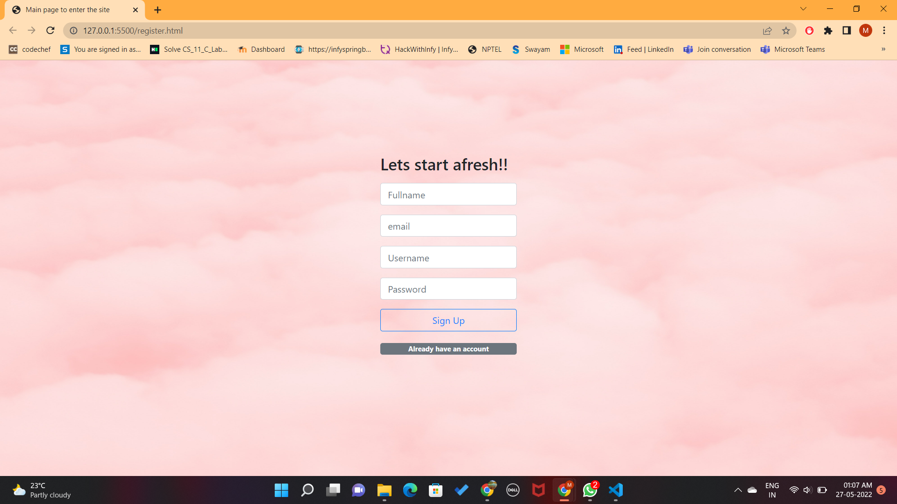
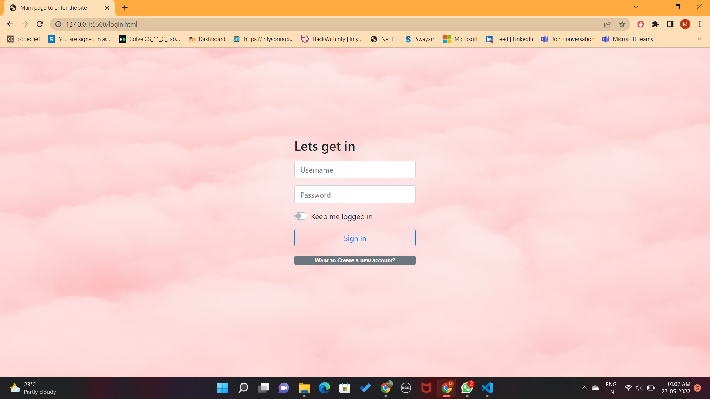
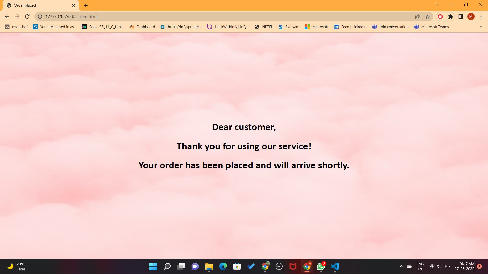

# A cafe website using face recognition

## Inspiration
We all crave for different kind of food in our day-to-day lives based on our emotions. This inspired me to create a platform where we could get a a suggestion like what kind of food we can order to have a change in our moods. 

## What it does?
This JavaScript-based application uses face- recoginition feature as to detect the face patterns using the device's camera and creates a coded pattern around the face. The emotion detector tells the users if their expression is a happy, neutral, sad or surprised one.

Then based on these emotions the website suggests you the type of food you can order to uplift your mood.

</img>

## Table of cantent

* Preview
* How it works?
* TechStack
* Development

## Preview
* Register page

  </img>
* Login page 
  
  </img>
* Emotion Detection
  
  </img>
* Website
  
  </img>

  </img>

* Order placed
  
  </img>

## How it works?

</img>

## TechStack

### The key technology used:
I am using prebuilt face-api.min.js for the face detection.

</img>

## Development

### Configuration

* To run this website start with register.html file.
  
### Setup
1. Run npm install in the root directory to install all      necassary dependencies.

