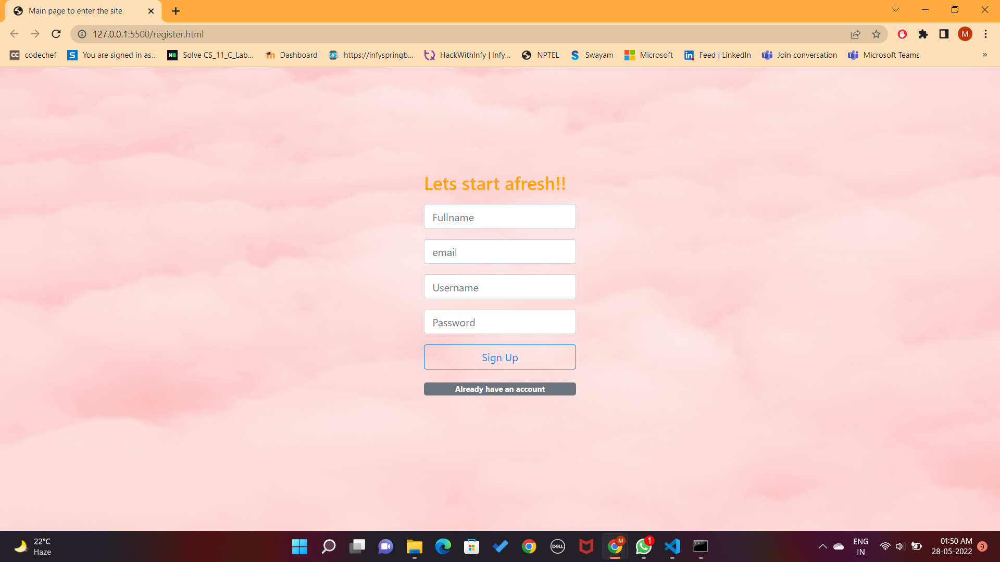
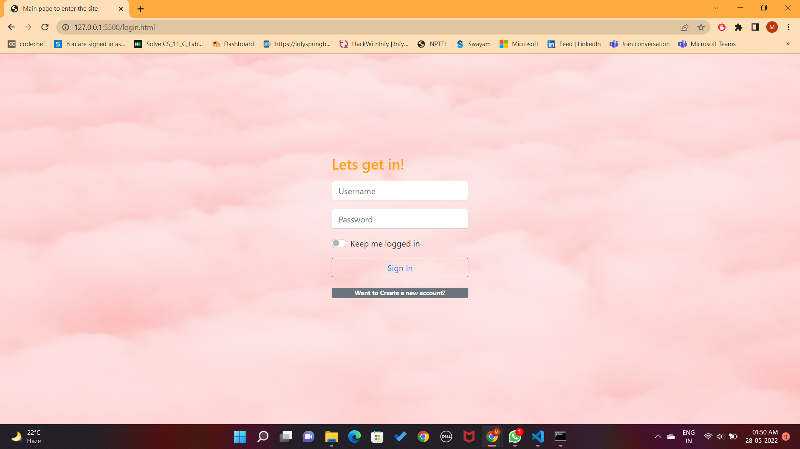
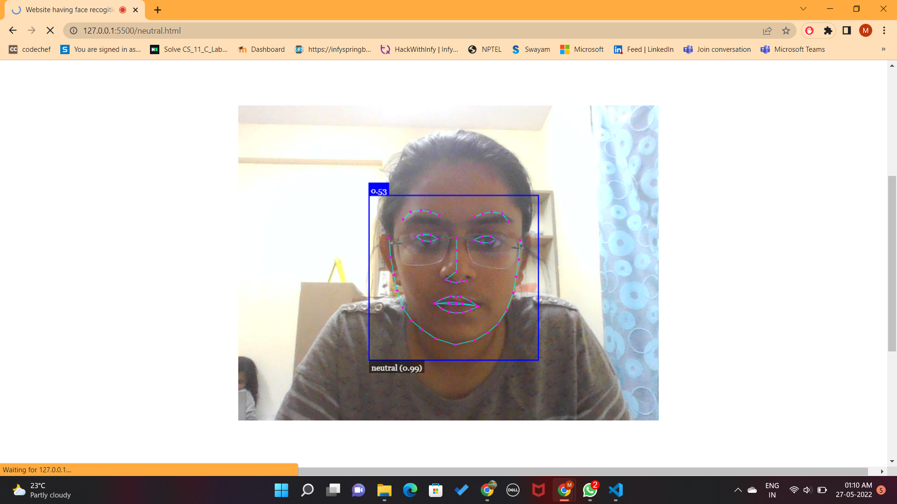
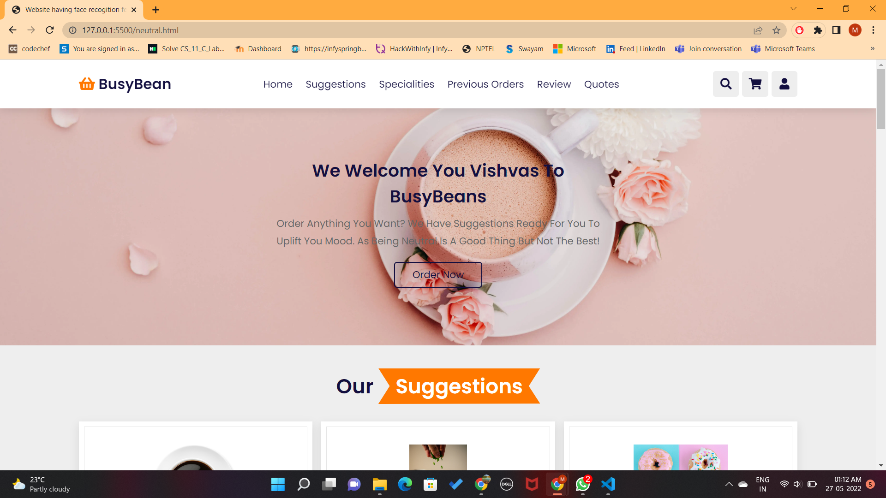
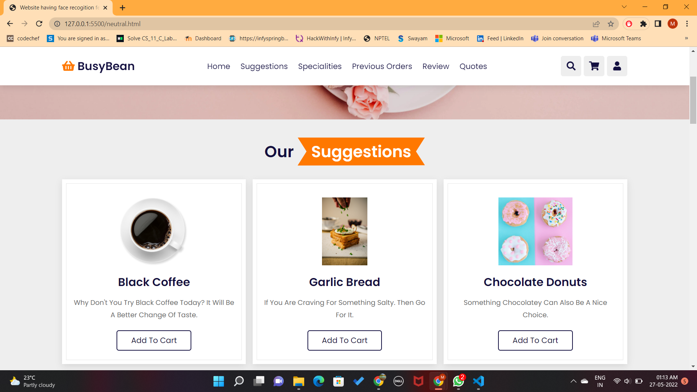
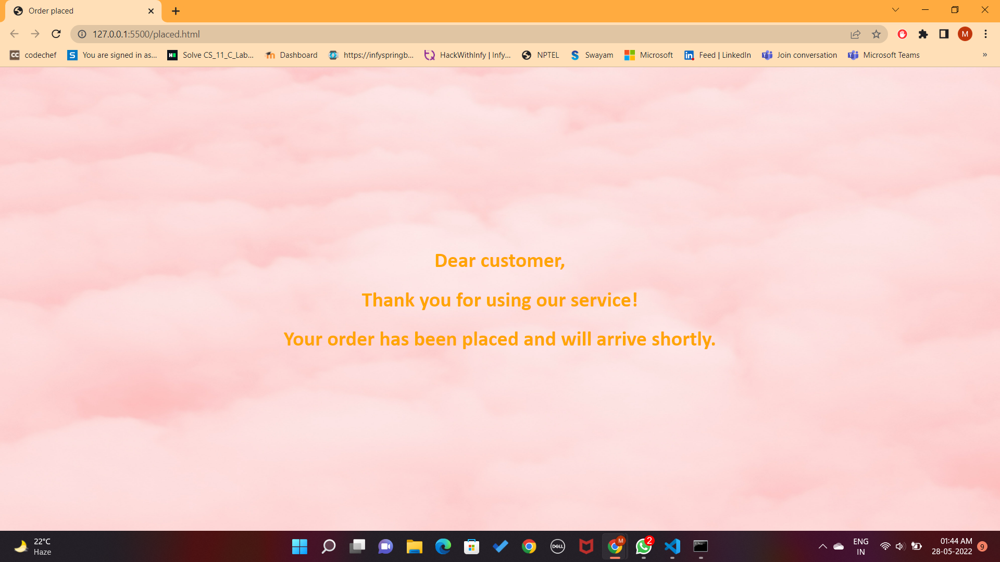
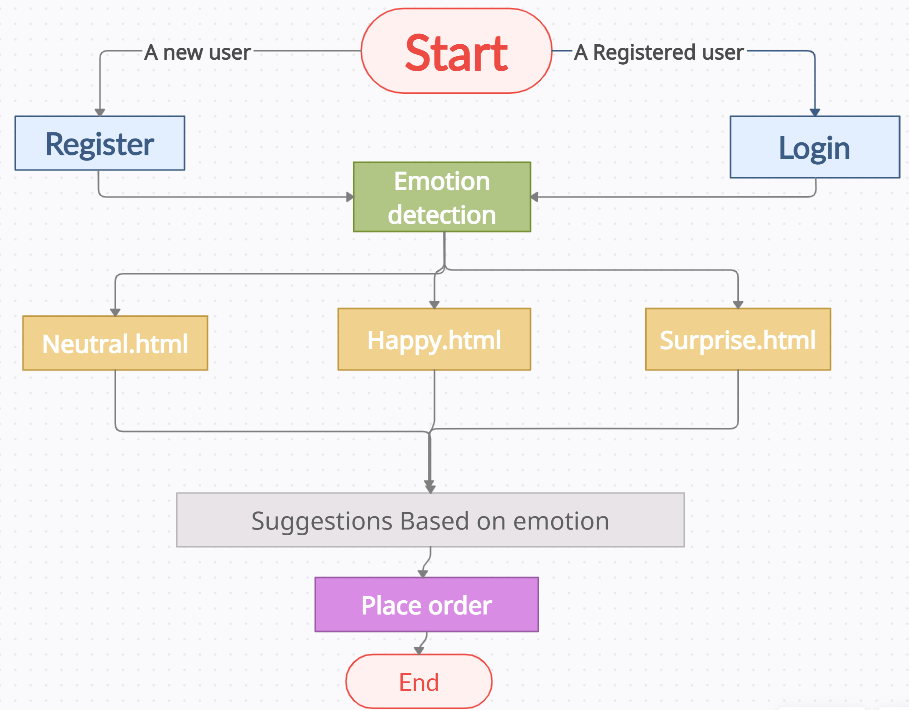
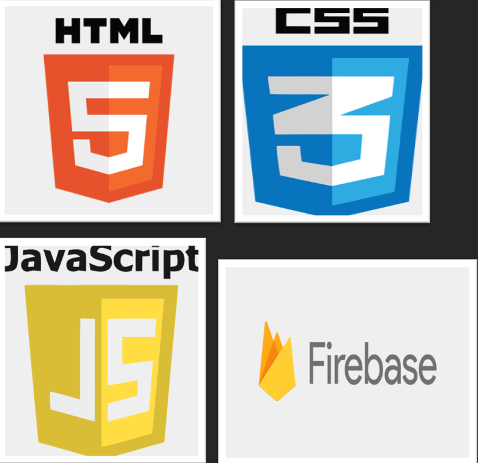

# A cafe website using face recognition

## Inspiration
We all crave for different kind of food in our day-to-day lives based on our emotions but sometimes it is difficult to decide the type of food you want to eat. So, this inspired me to create a platform where we could get a suggestion like what kind of food we can order for a change.  

## What it does?
This JavaScript-based application uses face- recognition feature as to detect the face patterns using the device's camera and creates a coded pattern around the face. The emotion detector tells the users if their expression is a happy, neutral, sad or surprised one.

Then based on these emotions the website suggests you the type of food you can order to uplift your mood.

## Table of content

* Preview
* How it works?
* TechStack
* Development

## Preview

This website is hosted on github. So, you can also open it by clicking on this link - https://medhavisingh.github.io/Cafe-website-using-face--recognition/

* Register page

  
* Login page 
  
  
* Emotion Detection
  
  
* Website
  
  

  

* Order placed
  
  

## How it works?

Whenever A new user visits the website, they will have to register as a new user and their data will be saved in the firebase database. So, if they visit the site again they just have to login to get started. 

After login the emotion detection window will open to record your emotions as happy, sad, surprise or neutral one. 

Based on your emotions the new page will open which will suggest you some kind of food to uplift your mood. You can select your choice of food and can order it from there only.

## TechStack

### The key technologies used:
I am using face-api.min.js for the face detection and firebase for storing the data of registered users.

## Development

### Configuration

* To run this website start with index.html file if your are running in on the local host.
  
### Setup
1. Run npm install in the root directory to install all necassary dependencies.
2. Download live server extension in your Visual Studio Code.